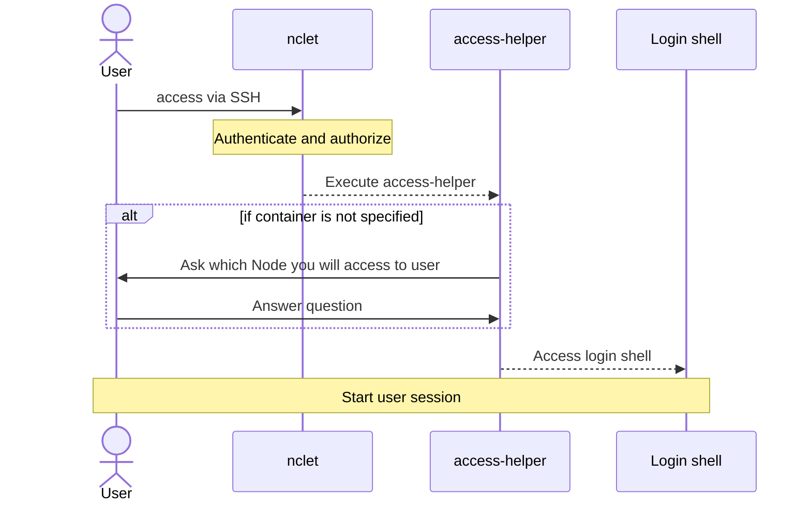

# access-helper

access-helper works with nclet and bridges users and ProblemEnvironment. 



## Getting started

### Prerequisites

Before getting started, you need to install the following components:

* ContainerLab
* Golang

### Build

You can build access-helper with `make access-helper-build`.

### Try access-helper

In order to try access-helper, you need to deploy Lab. In this section, we will use the following topology file.

```yaml
name: testlab
topology:
  nodes:
    n1:
      kind: linux
      image: alpine:latest
      labels:
        netcon.janog.gr.jp/accessMethod: exec
    n2:
      kind: linux
      image: linuxserver/openssh-server:latest
      env:
        USER_NAME: netcon
        USER_PASSWORD: netcon123
        PASSWORD_ACCESS: true
      labels:
        netcon.janog.gr.jp/accessMethod: ssh
        netcon.janog.gr.jp/username: netcon
        netcon.janog.gr.jp/password: netcon123
        netcon.janog.gr.jp/port: 2222
  links:
    - endpoints: ["n1:eth1","n2:eth1"]
```

```
$ sudo clab -t manifest.yaml deploy
INFO[0000] Containerlab v0.32.1 started                 
INFO[0000] Parsing & checking topology file: manifest.yaml 
WARN[0000] it appears that container host has low memory available: ~0Gi. This might lead to runtime errors. Consider freeing up more memory. 
INFO[0000] Creating lab directory: /home/jp26081/test/clab-testlab 
INFO[0000] Creating container: "n2"                     
INFO[0000] Creating container: "n1"                     
INFO[0000] Creating virtual wire: n1:eth1 <--> n2:eth1  
INFO[0001] Adding containerlab host entries to /etc/hosts file 
INFO[0001] 🎉 New containerlab version 0.32.3 is available! Release notes: https://containerlab.dev/rn/0.32/#0323
Run 'containerlab version upgrade' to upgrade or go check other installation options at https://containerlab.dev/install/ 
+---+-----------------+--------------+-----------------------------------+-------+---------+-----------------+----------------------+
| # |      Name       | Container ID |               Image               | Kind  |  State  |  IPv4 Address   |     IPv6 Address     |
+---+-----------------+--------------+-----------------------------------+-------+---------+-----------------+----------------------+
| 1 | clab-testlab-n1 | 40ee1d4cc8f0 | alpine:latest                     | linux | running | 172.20.20.14/24 | 2001:172:20:20::e/64 |
| 2 | clab-testlab-n2 | d9501e6790e7 | linuxserver/openssh-server:latest | linux | running | 172.20.20.15/24 | 2001:172:20:20::f/64 |
+---+-----------------+--------------+-----------------------------------+-------+---------+-----------------+----------------------+
```

After deploying Lab, you can access nodes with access-helper. Note that you need to execute access-helper with sudo privileges because access-helper needs to execute `containerlab inspect` to fetch management IP addresses for nodes.

```
$ sudo ../access-helper -t manifest.yaml n1
/ # echo "Hello world!"
Hello world!
/ # 

$ sudo ../access-helper -t manifest.yaml n2
Welcome to OpenSSH Server

n2:~$ echo "Hello world!"
Hello world!
n2:~$ 
logout
```

## Configuration

You can configure how to access nodes via labels field in ContainerLab topology files.

### `netcon.janog.gr.jp/accessMethod`

You can change how to access nodes with this label. Here are the acceptable values:

1. "exec": access nodes with `docker exec`
2. "ssh": access nodes through SSH

If you don't set this label, "ssh" access method will be used.

### `netcon.janog.gr.jp/adminOnly`

You can reject access from normal user to specific nodes with this label. "true" is the only acceptable value and other values will be considered as "false".

If you don't set this label, both normal user and admin user can access nodes.

### `netcon.janog.gr.jp/username`

You can set user name for SSH with this label. This label will be ignored when you use "exec" access method.

### `netcon.janog.gr.jp/password`

You can set password for SSH with this label. This label will be ignored when you use "exec" access method.

### `netcon.janog.gr.jp/port`

You can set password for SSH with this label. This label will be ignored when you use "exec" access method. If you don't set this label, 22/tcp is used to access nodes.
