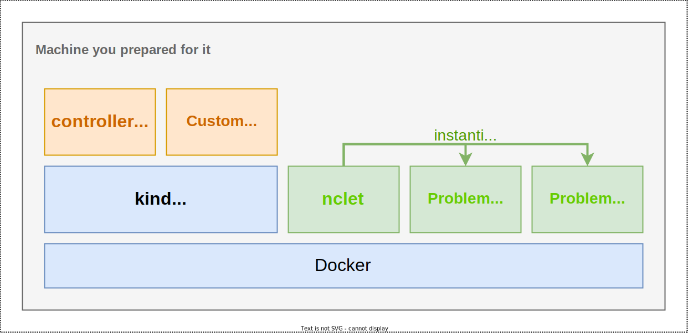

# How to set up a development environment

This page describes how to set up a development environment like the following.



## Prerequisites

* You need to prepare Linux VM (Ubuntu 22.04 is preferable)
* You need to install `build-essential`. 

## Installing prerequisites

To set up a development environment, you need to install the following items:

* Golang
* Docker
* kind
* kubectl

**Golang**

All controllers in netcon-problem-management-subsystem are written in Golang. First, to develop controllers, you need to install Golang development environment.

```bash
wget https://go.dev/dl/go1.19.2.linux-amd64.tar.gz
sudo rm -rf /usr/local/go && sudo tar -C /usr/local -xzf go1.19.2.linux-amd64.tar.gz
echo 'export PATH=$PATH:/usr/local/go/bin' >> ~/.bashrc
. ~/.bashrc
```

**Docker**

In order to run Kubernetes cluster on your machine and run nclet, you need to install Docker.

```bash
curl -L https://get.docker.com | sudo sh
```

If you'd like to execute `docker` without `sudo` command, you can add your user to `docker` group.

```bash
sudo usermod -aG docker "$(id -un)"
```

**kind**

[kind](https://kind.sigs.k8s.io/) is a handy tool to run Kubernetes clusters on your local machine.

```bash
curl -Lo ./kind https://kind.sigs.k8s.io/dl/v0.16.0/kind-linux-amd64
chmod +x ./kind
sudo mv ./kind /usr/local/bin/kind
```

**kubectl**

Of course, to communicate with Kubernetes, you need to install kubectl.

```bash
curl -LO "https://storage.googleapis.com/kubernetes-release/release/$(curl -s https://storage.googleapis.com/kubernetes-release/release/stable.txt)/bin/linux/amd64/kubectl"
chmod +x kubectl && sudo mv kubectl /usr/local/bin
```

## Deploying managers

First, you need to set up a Kubernetes cluster to run controllers.

```bash
kind create cluster
```

Next, you need to install cert-manager to generate and inject self-signed certificates for controller-manager.

```bash
kubectl apply -f https://github.com/cert-manager/cert-manager/releases/download/v1.9.1/cert-manager.yaml
```

Then, you can build and install managers with these commands.

```
git submodule update --init
make controller-manager-docker-build nclet-docker-build gateway-docker-build
make controller-manager-kind-push gateway-kind-push
```

Finally, you can deploy managers with this command.

```bash
make deploy
```

You can check the status of managers with `kubectl -n netcon get pods`.

```bash
$ kubectl -n netcon get pods 
NAME                                         READY   STATUS    RESTARTS   AGE
netcon-controller-manager-6b49cb47fb-mn967   2/2     Running   0          9d
netcon-gateway-fdccf68c5-x9vpb               1/1     Running   0          7m
```

## (optional) Setting up LoadBalancer

If you try managers which require external connectivity like Gateway, you need to set up LoadBalancer. First, you need to install MetalLB.

```bash
kubectl apply -f https://raw.githubusercontent.com/metallb/metallb/v0.13.7/config/manifests/metallb-native.yaml
```

Then, you need to configure MetalLB. You can configure MetalLB with helper script.

```bash
./scripts/generate_metallb_manifest.sh | kubectl apply -f -
```

Finally, you can create LoadBalancer freely.

```txt
$ cat service.yaml
apiVersion: v1
kind: Service
metadata:
  namespace: netcon
  name: gateway
spec:
  type: LoadBalancer
  selector:
    control-plane: gateway
  ports:
    - port: 8082
      targetPort: 8082

$ kubectl apply -f service.yaml
service/gateway created

$ kubectl -n netcon get svc
NAME                                        TYPE           CLUSTER-IP      EXTERNAL-IP    PORT(S)          AGE
gateway                                     LoadBalancer   10.96.196.144   172.18.0.200   8082:30483/TCP   11s
netcon-controller-manager-metrics-service   ClusterIP      10.96.233.209   <none>         8443/TCP         17d
netcon-webhook-service                      ClusterIP      10.96.239.112   <none>         443/TCP          17d

$ curl 172.18.0.200:8082
Gateway for score server
```


ref: https://kind.sigs.k8s.io/docs/user/loadbalancer/

## Deploying nclet

After deploying managers successfully, you can install nclet with these command. Note that workers can communicate with Kubernetes controll plane.

```bash
kind get kubeconfig > kubeconfig
mkdir ./data && chmod 0777 ./data
docker run -d --name nclet \
    --privileged --pid=host --net=host --ipc=host \
    -e KUBECONFIG=/etc/kubernetes/kubeconfig \
    -v /proc:/proc \
    -v /var/run/docker.sock:/var/run/docker.sock \
    -v $(pwd)/kubeconfig:/etc/kubernetes/kubeconfig \
    -v $(pwd)/data:/data \
    netcon-pms-nclet:dev
```

Now, you can deploy ContainerLab environment with this system. To try it, apply `./config/samples/netcon_v1alpha1_problemenvironment.yaml`.
